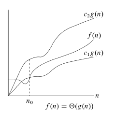
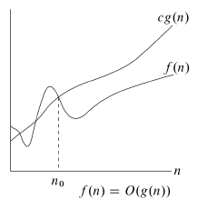

# Asymptotic analysis

## Big Theta Θ

T(n)= Θ(n<sup>2</sup>)

Θ(g(n)):={ f(n):exists positive const c<sub>1</sub>,c<sub>2</sub>>0, and n<sub>0</sub> such that 0<=c<sub>1</sub>g(n)<=f(n)<=c<sub>2</sub>g(n) for all n>=n<sub>0</sub>}



## Big Oh O

O(g(n)) = { f(n) : there exist positive constants c and n<sub>0</sub> such that 0<=f(n)<=cg(n) for all n>=n<sub>0</sub>}

Θ(g(n)) is subset of O(g(n))



## Prefix Averages calculation

X[1÷n] calculate A[i] = (Σ<sub>j=1->i</sub>X[j])/i

### Prefix averages(X)
```javascript
n=X.length
A=[]
A.len()=n
for i=1 to n
    a=0
    for j=1 to i
        a=a+X[i]
    A[i]=a/i
return A
```

line|cost
---|---
2|O(n)
4|O(n)
6|O(n<sup>2</sup>)

T(n)=O(n)+O(n)+__O(n<sup>2</sup>)__

## Prefix Averages 2

```javascript
n=len(x)
A=[]
A.len()=n
s=0
for i=1 to n:
    s=s+X[i]
    A[i]=S/i
return A
```

line|cost
---|---
2|O(n)
4|O(n)
5|O(n)
8|O(n)

T(n)=__O(n)__+O(n)+O(n)+O(n)

# Complexities

name|order of growth|example
---:|---:|---:
constant|1|a=b+c
logarithmic|log(n)|binary search
linear|n|prefix-averages-2
quadratic|n<sup>2</sup>|2 nested for loops
cubic|n<sup>3</sup>|3 nested for loops
exponential|2<sup>n</sup>|hamiltonian path in a graph