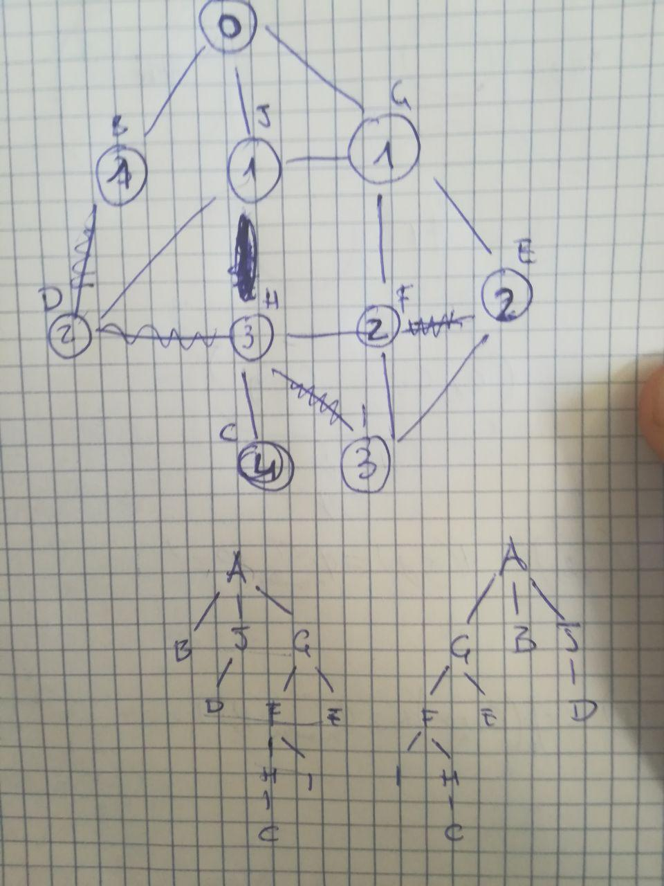

# Algorithmic Methods: Exam Simulation

## Exercise 1

1. $T(n) = 3T(\frac{n}{2}) + O(n)$

2. $log_2n$

3. $n^{log_23}+1$

4. $log_ba - \epsilon = 1$

    sol = $\Theta(n^{log_23})$

    alt sol = $T(n) = \sum_{i = 0}^{log_2n-1}(\frac{1}{2})^i*n + \Theta(n^{log_23})$

    $\sum_{i = 0}^{log_2n-1}(\frac{1}{2})^i*n < \Theta(n^{log_23})\implies \Theta(n^{log_23})$

## Exercise 2

1. 181

2. 120/200 = 0.6

3. 225 mod 53 = 13

## Exercise 3

_ |_|__b__|__a__|__a__|__b__|__c__
---|---|---|---|---|---|---
_|0|0|0|0|0|0
__b__|0|1↖|1←|1←|1↖|1←
__c__|0|1↑|1←|1←|1←|2↖
__a__|0|1↑|2↖|2↖|2←|2←
__b__|0|1↖|2↑|2←|3↖|3←
__a__|0|1↑|2↖|3↖|3←|3←

## Exercise 4

1. True

2. False ("best" worst case is nlogn)

3. False

4. True

5. False (Comparison sorts require at least O(nlogn))

## Exercise 5

a) False

b) True

c) False

d) False

e) False

f) True

## Exercise 6

