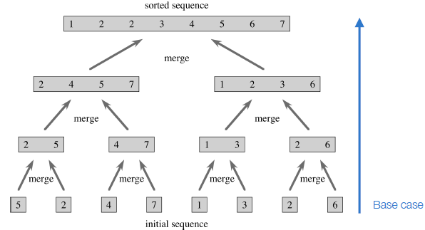

# Recursion

## Divide et Impera

* __Divide__ the problem into smaller sub-problems
* __Impera__ the sub-problems by solving them one at a time
* __Combine__ the solutions of the subproblems into the solution for the general problem

### Iterative vs Recursive

#### power(x,n)

##### Iterative

```javascript
power(x,n){
    result=1
    for i=1 to n:
        result=result*x
    return result
}
```

##### Recursive

```javascript
power(x,n){
    if(n==1)
        return x // base case
    else
        return x*power(x,n-1) // recursive step
}
```

### Execution stack

When an algorithm calls itself (nested call):
1. the current execution is paused
2. the execution context associated with the current alg exec is stored in a stack
3. the nested call executes
4. after it ends the previous exe context is retrieved from the stack and the execution is resumed from where it stopped

### Merge-Sort

1. Assume to have an unordered sequince of n elements
2. __Divide__ the sequence in two sequences with length n/2
3. __Impera__: sort the two sequences using merge-sort recursively
4. __Combine__: merge the two ordered sequences into the output sequence



```javascript
//A = array
//p = first element
//r = last element
mergesort(A,p,r)
    if(p<r):
        q=(p+r)/2 // ground
        mergesort(A,p,q)
        mergesort(A,q+1,r)
        merge(A,p,q,r)
```

```javascript
merge(A,p,q,r)
    n1=q-p+1
    n2=r-q
    L=[]
    R=[]
    L.len()=n1
    R.len()=n2
    for i=1 to n1:
        L[i]=A[p+i-1]
    for j=1 to n2:
        R[j]=A[q+j]
    L[n1+1]=inf
    R[n2+1]=inf
    i=1
    j=1
    for k=p to r:
        if L[i]<=R[j]:
            A[k]=L[i]
            i++
        else:
            A[k]=R[j]
            j++
```

T(n) = 

* Θ(1) if n<=c
* aT(n/b)+D(n)+C(n) otherwise
    * a = number of subproblems
    * n/b = size of subproblem
    * n = power of 2

2T(n/2)+Θ(1)+Θ(n)

T(n)=2T(n/2)+Θ(n)=2T(n/2)+cn

\# of levels = log(n)+1

__proof by induction__

* __Base__: n=1 log(1)=0
* __ind__:

    let's assume than n=2<sup>i</sup>
    
    ok...

&#9633;

T(n)=cn*log(n)+cn